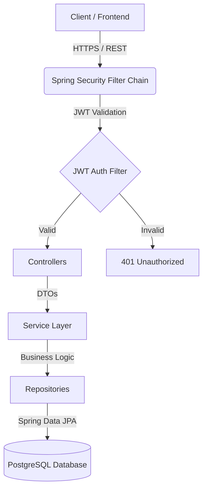

<div align="center">

# 🕵️‍♂️ Lost & Found Portal Backend 

An enterprise-grade, highly secure Spring Boot backend for managing lost and found item reports. Built with scalability, security, and developer experience in mind.

[](https://spring.io/projects/spring-boot)
[](https://www.postgresql.org/)
[](https://www.docker.com/)
[](https://jwt.io/)
[](https://swagger.io/)

*Frontend Application:* [agalzh/lost_and_found_frontend](https://github.com/agalzh/lost_and_found_frontend)

</div>

---

## ✨ Overview

This project serves as the robust REST API backbone for a full-stack Lost & Found portal. It enables users to document, track, and recover lost items or report items they have found. 

Designed with a modern Java ecosystem, it leverages **Spring Boot 3**, **Spring Security**, and **JWT Authentication** to ensure that data remains protected, while utilizing **PostgreSQL** for reliable, relational data persistence.

## 🔥 Key Features

- **🛡️ High Security**: Stateless, highly secure JSON Web Token (JWT) authentication safeguarding all protected endpoints.
- **👥 Role-Based Access Control (RBAC)**:
  - `GUEST` (Unauthenticated): Browse and search all published lost & found posts.
  - `USER`: Create, edit, and delete their own posts. Upload item pictures and descriptions.
  - `ADMIN`: Full administrative privileges, including moderating and deleting any post on the platform.
- **🐳 Docker Ready**: Effortless deployment using containerization. A fully configured `docker-compose` setup is included.
- **📖 Interactive API Documentation**: Integrated Swagger UI (`springdoc-openapi`) allows for seamless API exploration and testing.
- **⚡ Optimized Architecture**: Uses `ModelMapper` for clean DTO mappings, `Lombok` to reduce boilerplate, and `Spring Data JPA` for robust data access.

---

## 🏗️ Architecture

The backend follows a standard multi-layer Spring Boot architecture, promoting a clear separation of concerns and maintainability.



- **Controllers**: Handle incoming HTTP requests, route them, and send back HTTP responses.
- **Service Layer**: Contains the core business logic (e.g., verifying if a user owns a post before deleting it).
- **Repositories**: Interfaces extending `JpaRepository` for seamless CRUD operations with the PostgreSQL database.
- **Security**: The `JwtAuthenticationFilter` intercepts requests to ensure the user is authenticated before reaching protected endpoints.

---

## 🚀 Getting Started (The Docker Way)

The fastest and easiest way to run the application is using Docker. No Java setup required!

**Prerequisites:** [Docker](https://www.docker.com/) and Docker Compose installed.

1. **Clone the repository**
   ```bash
   git clone https://github.com/justleviackermann/lost_and_found.git
   cd lost_and_found
   ```

2. **Configure Environment Variables**  
   The application requires your database credentials to be exported as environment variables:
   ```bash
   export DBUSERNAME="your_custom_username"
   export DBPASSWORD="your_super_secret_password"
   ```

3. **Spin up the containers**
   ```bash
   docker compose up -d
   ```
   *This command will pull the necessary images, set up the PostgreSQL database, and launch the Spring Boot backend.*

4. **Explore the API**  
   Navigate to the Swagger UI to test the endpoints interactively:  
   👉 **http://localhost:8080/swagger-ui/index.html**

---

## 💻 Local Development Setup

If you want to contribute, run tests, or modify the code, setting up your local environment (preferably with IntelliJ IDEA) is highly recommended.

**Prerequisites:** Java 25+, Maven.

1. **Clone the repository**
   ```bash
   git clone https://github.com/justleviackermann/lost_and_found.git
   cd lost_and_found
   ```

2. **Export Database Credentials**
   ```bash
   export DB_USERNAME="your_custom_username"
   export DB_PASSWORD="your_super_secret_password"
   ```
   *(Note: Ensure you have a local PostgreSQL instance running with a database named `landf` matching these credentials).*

3. **Build and Run**  
   Using the included Maven wrapper:
   ```bash
   ./mvnw clean compile
   ./mvnw spring-boot:run
   ```
   *Alternatively, just open the project in IntelliJ IDEA, sync the Maven dependencies, and hit the **Run** button!*

---

## 🛠️ Tech Stack

- **Framework**: Spring Boot (Web, Security, Data JPA, Validation)
- **Database**: PostgreSQL
- **Security**: Spring Security + jjwt (JSON Web Tokens)
- **Documentation**: Springdoc OpenAPI (Swagger UI)
- **Utilities**: Lombok, ModelMapper

---

<div align="center">
  <i>Built with passion to help people find what they lost.</i>
</div>
